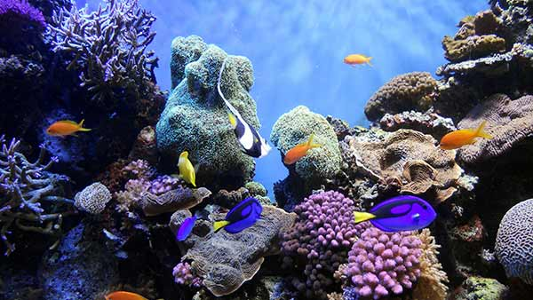
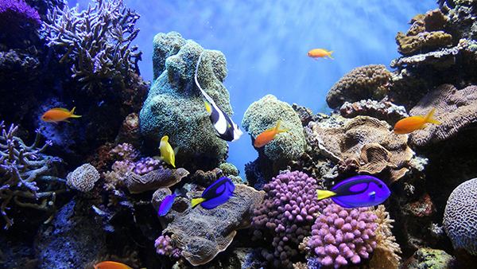

<!DOCTYPE html>
<html lang="en">
  <head>
    <meta charset="UTF-8" />
    <title>Web Images</title>
  </head>

  <body>

    <h1>Web Images</h1>

    
Original Image: 1.9MB

    
    
Low quality (25%). File size: 43.6k 

    
    
Medium quality (40%). File size: 55.7k 

    
    
High quality (70%). File size: 116.8k 

    
    
Very quality (90%). File size: 212.9k 

    
    
Maximum quality (100%). File size: 299.6k 

  </body>
</html>
